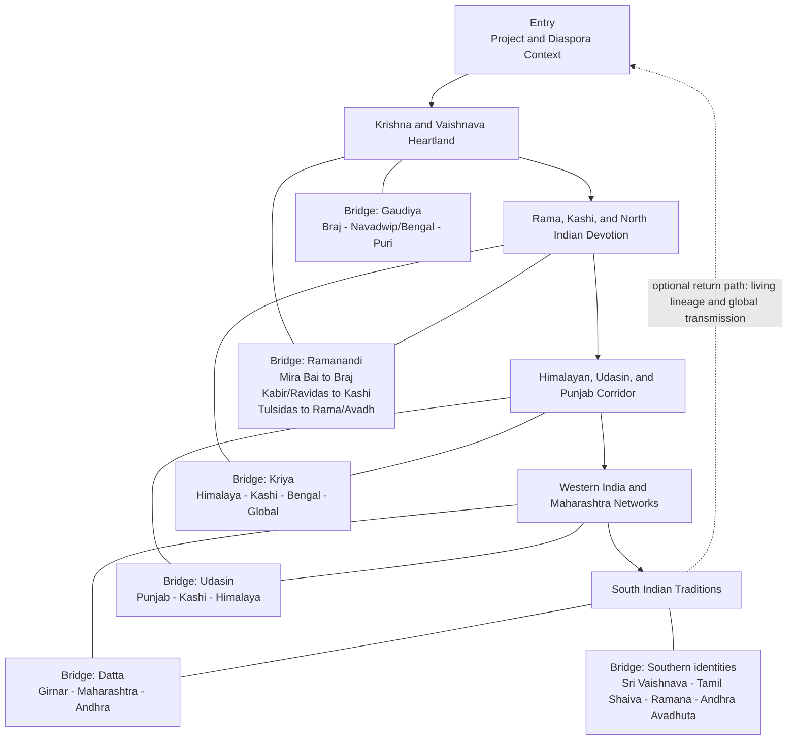

# Museum layout visuals

This proposal turns the museum-section assignments into archivalist-facing
visitor-flow visuals. It assumes the museum sections remain private planning
metadata unless a later review explicitly marks any collection as public.

The layout principle is a connected pilgrimage circuit. Sections keep their own
identity, but bridge saints and bridge traditions are placed near section edges
so the whole museum reads as one devotional landscape rather than separate
taxonomy buckets.

## Visual 1: Visitor Flow Map With Bridge Edges

Use this map to propose the primary room or wall sequence and the most important
visitor-facing bridges in the same view. The solid path is the main visitor
flow. The dotted edges are interpretive bridges that can appear as sightlines,
shared labels, threshold panels, or nearby vitrines.

```mermaid
flowchart LR
  A["Entry: Project and Diaspora Context<br/>Bhakti Marga & Mauritius Lineage<br/>Global & Diaspora Lineages"]
  B["Krishna and Vaishnava Heartland<br/>Braj & Krishna Bhakti<br/>Gaudiya Vaishnava<br/>Jagannath-Puri & Odisha<br/>Bengal Shakta, Baul & Modern Saints"]
  C["Rama, Kashi, and North Indian Devotion<br/>Ramanandi<br/>Rama & Avadh<br/>Kashi & Ascetic Lineages<br/>Buddhist Saints"]
  D["Himalayan, Udasin, and Punjab Corridor<br/>Rishikesh-Haridwar & Himalayan Monastic Lineages<br/>Udasin Saints<br/>Sikh & Punjab Traditions"]
  E["Western India and Maharashtra Networks<br/>Gujarat & Swaminarayan Traditions<br/>Girnar & Nath Traditions<br/>Datta Tradition<br/>Maharashtra Guru Lineages<br/>Varkari"]
  F["South Indian Traditions<br/>Andhra Avadhuta & Datta-Advaita Lineages<br/>Sri Vaishnava & South Indian Vaishnava Traditions<br/>Shaiva Siddhanta & Tamil Traditions<br/>Ramana & Arunachala"]

  A -->|"diaspora and transmission"| B
  B -->|"Ramanandi hinge: Mira Bai, Kabir, Ravidas, Tulsidas"| C
  C -->|"Kashi to Himalaya: renunciant and Kriya links"| D
  D -->|"ascetic corridor to Girnar and Datta"| E
  E -->|"Datta and avadhuta bridge"| F

  B -. "Gaudiya links Braj, Bengal, and Puri" .-> B
  C -. "Ramanandi links Braj, Kashi, and Rama/Avadh" .-> B
  D -. "Kriya links Himalaya, Kashi, Bengal, and Global" .-> A
  E -. "Datta links Girnar, Maharashtra, and Andhra" .-> F
```

## Visual 2: Visitor Circuit Map

Use this as the more spatial version of the same idea. It reads like a visitor
circuit: the outside loop is the walkable sequence, and the inner bridge nodes
explain why specific sections should sit near one another. This may be the
cleanest visual for the archivalist because it shows flow and rationale at the
same time.

### Bridge Cards

| Bridge | Connects | Evidence to show | Visitor-flow implication |
| --- | --- | --- | --- |
| Ramanandi | Braj/Krishna, Rama/Avadh, Kashi | Mira Bai, Kabir, Ravidas, Tulsidas, Ramanandacharya curatorial family | Let the visitor move naturally from Krishna devotion into Kashi/Rama material through named saints. |
| Gaudiya | Braj, Bengal/Navadwip, Puri/Odisha, global Gaudiya expansion | Chaitanya, Nityananda, Vrindavan Goswamis, Gaudiya Math, Puri-linked families | Make the Krishna zone feel internally connected rather than split into place-only clusters. |
| Kriya | Himalaya, Kashi, Bengal, Puri, Global | Mahavatar Babaji family, Lahiri Mahasaya, Sri Yukteswar, Yogananda | Let the Himalayan section carry a visible thread back to Kashi, Bengal, and diaspora. |
| Udasin | Sikh/Punjab, Kashi, Himalaya | Baba Udasin, Uttarkashi Udasin family, Sikh/Punjab adjacency | Use a small threshold display between Punjab and ascetic/Himalayan material. |
| Datta | Girnar, Maharashtra, Andhra/Karnataka | Dattatreya incarnation cluster, Narasimha Saraswati, Swami Samarth, Datta belt | Let visitors cross from western ascetic material into Maharashtra and southern avadhuta material. |
| Maharashtra | Datta, Varkari, modern guru lineages | Shirdi Sai, Five Perfect Masters, Samarth Ramdas, Nityananda, Varkari proximity | Treat Maharashtra as a dense network zone with several internal paths. |
| South India | Sri Vaishnava, Tamil Shaiva, Ramana, Andhra Avadhuta | Ramanuja, Tirumala/Hathiram, Pamban Swamigal, Ramana, Andhra avadhuta families | Let the final zone read as a set of neighboring southern identities rather than one merged category. |

## Recommended Proposal Package

Send the archivalist these two visuals:

1. Visitor Flow Map With Bridge Edges: "What sequence should the museum follow, and where do the bridges appear?"
2. Visitor Circuit Map: "How does the layout feel like one connected whole?"

Detailed section counts, anchor cards, and review boards can be prepared after
the archivalist agrees with the overall flow.
